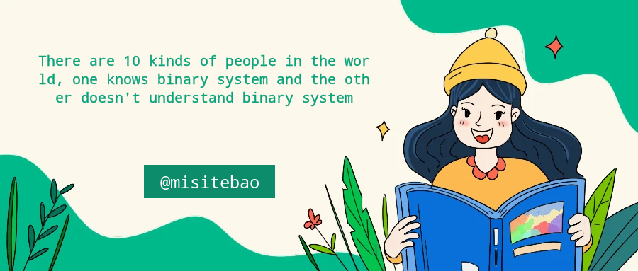

### Hi 👋 My self introduction:👇

- 🔭 I’m currently working on NodeJS Golang
- 🌱 I’m currently learning Golang 
- 👯 I’m looking to collaborate on contribute to interesting open source projects together
<!-- - 🤔 I’m looking for help with find Golang develop job -->
- 💬 Ask me about Wechat：misitebao_work
- 📫 How to reach me: i@misitebao.com
- 😄 Pronouns: There are 10 kinds of people in the world, one knows binary system and the other doesn't understand binary system
- ⚡ Fun fact: Study hard and make progress every day
